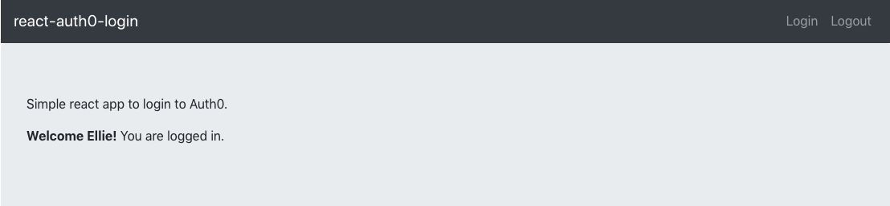
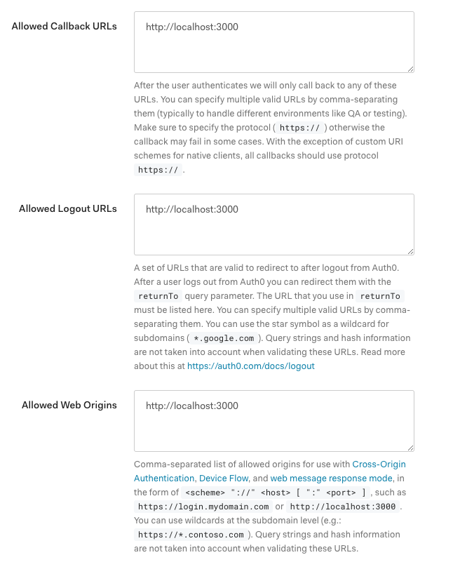
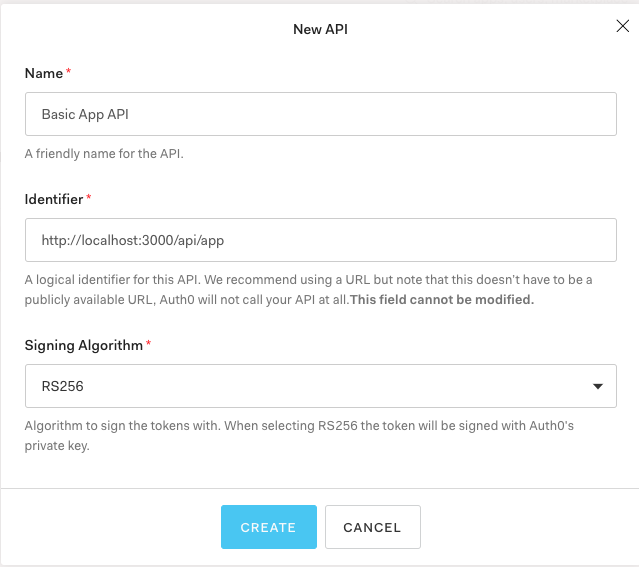

# react-auth0-login

React single page app that uses Auth0 for authentication.  Based on samples from Auth0 as well as the Auth0 blog: https://auth0.com/blog/authentication-in-golang/.

<p  align="center">
    
</p>


Config setup
1. create an Auth0 account and login
2. create a Single Page Web Application
3. set Allowed Callback URLs and Allowed Logout URLs and Allowed Web Origins to http://localhost:3000
<p  align="center">
    
</p>

4. create an API (the API identifier is the value used for REACT_APP_AUDIENCE environment variable below)
<p  align="center">
    
</p>

Initial setup
```
npm install
```

Run
```
export REACT_APP_DOMAIN=-- insert here --
export REACT_APP_CLIENTID=-- insert here -- 
export REACT_APP_AUDIENCE=-- insert here -- 
npm start
```
Open [http://localhost:3000](http://localhost:3000) to view it in the browser.

Docker build
```
docker build --tag react-auth0-image .
docker run --name react-auth0 -it -p 3000:3000 -d react-auth0-image
```

Docker cleanup
```
docker rm -f react-auth0
docker rmi react-auth0-image
```

Production Build
```
  npm run build
  npm install -g serve
  serve -s build
```
